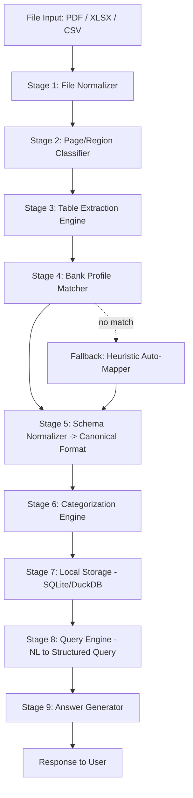

# High Level Design (HLD)
## Offline Multi-Bank Statement Parser & Natural Language Query System

**Version:** 1.0
**Date:** July 2026
**Status:** Draft for implementation

---

## 1. Objective

Build a fully **offline** system that:

1. Ingests bank statements (PDF/Excel/CSV) from **any bank, any format**.
2. Normalizes them into a single canonical schema regardless of source format.
3. Answers **arbitrarily complex natural language queries** over the normalized data — with no internet dependency at any stage.

**Non-negotiable constraints:**
- Zero external API calls (no cloud LLM, no cloud OCR, no cloud DB).
- Must generalize across bank formats without hardcoding per-bank logic wherever avoidable.
- Must degrade gracefully (partial success) instead of hard-failing on unseen formats.

---

## 2. Why the Current System Fails (Root Cause Framing)

The current "kabhi kaam karta hai kabhi nahi" behavior almost always comes from **conflating two separate problems into one monolithic parser**:

| Problem | Symptom if not isolated |
|---|---|
| Every bank has a different **visual/structural layout** | Parser breaks the moment a new bank's PDF is fed in |
| Every bank has different **semantics** (what "Amount" column means, category presence, etc.) | Even if extraction works, downstream query logic gives wrong answers |
| PDFs have **non-data pages** (banners, T&C, summaries) mixed with data pages | Garbage rows get extracted, corrupting everything downstream |

The fix is architectural: **separate extraction from interpretation, and separate interpretation from querying**, with a well-defined canonical schema sitting in between. This HLD is built around that separation.

---

## 3. High Level Architecture



Each stage is an independent, testable module with a strict input/output contract. This is the single most important design decision — it's what makes the system debuggable when it fails on a new bank format (you'll know exactly which stage broke).

---

## 4. Component-by-Component Design

### Stage 1 — File Normalizer
**Purpose:** Convert any input format into a common internal representation (list of pages, each page = text blocks + positions + tables if detectable).

- PDF (digital/text-based): extract text with positional coordinates (not just raw text — position matters for table reconstruction).
- PDF (scanned/image): route to offline OCR.
- XLSX/CSV: load as raw grid (don't assume header row yet).
- Handle password-protected PDFs (try common patterns: DOB, account number, PAN — configurable per bank, or prompt user once).

**Offline tools:** `pdfplumber` / `PyMuPDF (fitz)` for digital PDFs, `Tesseract OCR` for scanned PDFs.

**Key problem this solves:** Removes format-specific parsing from every downstream stage — everything after this sees one uniform structure.

---

### Stage 2 — Page/Region Classifier
**Purpose:** Decide, page by page (and even region by region within a page), what kind of content it is:

- `TRANSACTION_TABLE`
- `BANNER / MARKETING`
- `ACCOUNT_SUMMARY` (opening/closing balance box — looks table-like but isn't transaction data)
- `DISCLAIMER / FOOTER`
- `HEADER (bank letterhead)`

**How, offline:**
- Rule-based signal scoring: presence of repeated date-like patterns, presence of a column header row (Date/Amount/Balance/Description keywords in multiple languages if needed), row count, numeric density.
- A lightweight local classifier (e.g., a small logistic regression / decision tree trained on a few hundred labeled pages from different banks) can outperform pure rules once you have some data — but rules alone can get you 80% of the way and are fully explainable.

**This directly solves your "page 1/2 is banner" problem** — instead of assuming a fixed page number, every page is independently classified, and only `TRANSACTION_TABLE` regions flow to Stage 3.

---

### Stage 3 — Table Extraction Engine
**Purpose:** From classified `TRANSACTION_TABLE` regions, extract actual rows and columns.

- Use table-detection libraries (`camelot`, `pdfplumber`'s table finder, or custom logic using text x/y coordinates to cluster into columns).
- Handle tables that **span across pages** — table continuity detection: if the last row of page N and structure of page N+1 both look like the same table with no repeated header, stitch them.
- Handle merged cells / multi-line descriptions within a single transaction row.

**Output:** Raw row-level data, still bank-specific (unknown column meanings yet).

---

### Stage 4 — Bank Profile Matcher
**Purpose:** This is the core of multi-bank generalization.

Maintain a **profile registry** — a set of JSON/YAML "bank profiles" that describe known formats:

```json
{
  "bank_name": "HDFC",
  "identifiers": ["HDFC BANK", "IFSC HDFC"],
  "column_map": {
    "date": ["Date", "Txn Date"],
    "description": ["Narration", "Particulars"],
    "debit": ["Withdrawal Amt", "Debit"],
    "credit": ["Deposit Amt", "Credit"],
    "balance": ["Closing Balance"]
  },
  "date_format": "DD/MM/YY",
  "number_format": "indian_comma"
}
```

- When a statement comes in, first try to **match it against a known bank profile** (via bank name detection + header keyword matching).
- If matched → deterministic, high-confidence mapping.
- If **no match** (new/unseen bank) → fall back to **Stage 4a: Heuristic Auto-Mapper**.

### Stage 4a — Heuristic Auto-Mapper (Fallback for unseen formats)
This is what makes the system generalize instead of breaking on new banks:

- Column type inference by **content analysis**, not just header names:
  - A column where >90% of values match a date regex → `date` column.
  - A column where values are numeric and mostly negative/positive consistently → `debit`/`credit`.
  - A single `Amount` column with a separate `Type` (Dr/Cr) column → detect and combine.
  - Longest free-text column → `description`.
  - A column that's monotonically-ish changing and numeric → `balance` (sanity-checkable: `balance[i] = balance[i-1] ± amount[i]`).
- **This balance-reconciliation check is your best friend** — it's a self-validating signal. If debit/credit assignment is correct, running balance math will match almost perfectly. If it doesn't, you know extraction is wrong *before* it reaches the user — this is how you catch "kabhi kaam karta hai" failures automatically instead of silently.
- Once auto-mapped successfully, **save it as a new learned profile** — the system gets better with every new bank statement it processes (semi-supervised growth of your profile registry).

---

### Stage 5 — Schema Normalizer
**Purpose:** Convert everything, regardless of source, into one canonical schema:

```
transaction_id | date (ISO) | description | debit | credit | balance | category | source_bank | raw_row_ref
```

- Normalize date formats, number formats (Indian vs international comma), currency symbols, negative-in-brackets notation.
- Every query in Stage 8 only ever needs to know this ONE schema — this is what decouples "bank format chaos" from "query logic," which is the actual fix for your core problem.

---

### Stage 6 — Categorization Engine
**Purpose:** Assign categories (Food, Rent, Salary, Shopping, etc.) when the bank doesn't provide them — this is most banks.

Offline-friendly approach (no cloud LLM needed):
- **Rule/keyword-based first pass:** regex/keyword dictionaries against `description` (e.g., "SWIGGY|ZOMATO" → Food, "NEFT.*SALARY|SAL CREDIT" → Salary).
- **Local embedding-based fallback** for descriptions that don't match rules: use a small offline sentence-embedding model (e.g., a quantized `all-MiniLM` via `sentence-transformers`, running fully local on CPU) to match against a small set of category-representative phrases. This handles messy UPI/merchant strings without needing a cloud LLM.
- **Recurring-transaction detection** (for salary, EMI, rent): group by similar amount + similar day-of-month + similar description pattern occurring across multiple months.
- User-correction feedback loop: if user corrects a category, store it — improves future categorization for that user/bank.

---

### Stage 7 — Local Storage
- Use **SQLite** or **DuckDB** (DuckDB is excellent for analytical queries — sums, group-bys — which is most of what financial queries need, and it's embedded/offline by design).
- One normalized transactions table + a metadata table (which bank, which statement period, extraction confidence score per row).
- Store an **extraction confidence score** per row/statement — critical for debugging and for telling the user "this statement was parsed with X% confidence" instead of silently returning wrong answers.

---

### Stage 8 — Query Engine (NL → Structured Query)
**Purpose:** Convert natural language into something answerable against the canonical schema — offline.

Two viable offline approaches, often combined:

**A. Local LLM (recommended primary approach)**
- Run a small quantized open-weight model locally (e.g., via `llama.cpp` / `Ollama`) — something in the 3B–8B range quantized (GGUF Q4) runs fine on CPU for this kind of structured task.
- Prompt it to translate the NL query into a **structured intermediate representation** (JSON: filters, aggregation, group-by, date range) rather than raw SQL directly — safer and easier to validate.
- Example: *"pichle 3 mahine mein sabse zyada kharcha kis category mein hua"* →
```json
{"intent": "top_category_by_spend", "date_range": "last_3_months", "type": "debit"}
```
- Then a deterministic code layer converts this JSON → actual DuckDB/SQL query. **Never let the LLM write SQL directly against real data without this intermediate validation layer** — reduces hallucinated queries and makes failures debuggable.

**B. Rule/intent-based fallback**
- For a core set of common query patterns (totals, top-N, recurring, category breakdown, date-range filters), have deterministic pattern matchers as a fast, 100%-reliable fallback when the local LLM's confidence is low or output doesn't validate against the schema.

This hybrid (local LLM + deterministic fallback + schema validation) is what gives you **reliability with complex queries while staying offline** — pure rule-based won't scale to "arbitrarily complex" queries, and pure local-LLM-only will be inconsistent, which is exactly your current symptom.

---

### Stage 9 — Answer Generator
- Take the structured query result (numbers/rows) and generate a natural language answer, optionally using the same local LLM for phrasing (low-risk since it's just presenting already-computed facts, not deciding what the facts are).

---

## 5. Error Handling & Confidence Strategy

This is what turns "sometimes works" into "always gives a trustworthy answer, even if that answer is 'I couldn't extract this reliably.'"

| Failure Point | Detection | Fallback |
|---|---|---|
| Unrecognized bank format | No profile match | Heuristic auto-mapper (Stage 4a) |
| Column mapping uncertain | Balance-reconciliation check fails | Flag statement as low-confidence, ask user to confirm column mapping via a simple UI, save as new profile |
| OCR extraction poor quality | High OCR uncertainty score / balance check fails | Surface specific rows to user for manual correction instead of silently including bad data |
| Query engine produces invalid structured query | Schema validation fails | Fall back to rule-based intent matcher; if that also fails, respond "I couldn't understand this query confidently" rather than guessing |
| Category unknown | No rule/embedding match above threshold | Mark as "Uncategorized" rather than guessing wrong |

**Golden rule:** never silently guess when confidence is low — surface it. This alone will fix most of the client trust issue, because a predictable "I'm not confident about X" is far better than an unpredictable wrong answer.

---

## 6. Suggested Offline Tech Stack

| Layer | Tool |
|---|---|
| PDF text/table extraction | `pdfplumber`, `PyMuPDF`, `camelot` |
| OCR (scanned PDFs) | `Tesseract` (offline) |
| Data processing | `pandas` |
| Storage/query engine | `DuckDB` or `SQLite` |
| Categorization embeddings | `sentence-transformers` (quantized, local, CPU) |
| NL query understanding | Local quantized LLM via `llama.cpp` / `Ollama` (e.g., Llama 3.1 8B Q4, or Phi/Mistral-class small model) |
| Bank profile storage | JSON/YAML files, versioned |
| App/API layer | Python (FastAPI) — keeps this a local service, no internet needed |

---

## 7. Build Order (Practical Roadmap)

1. **Stage 1–3** (extraction pipeline) — get this rock solid across your top 5–10 client banks first. This is 70% of your current pain.
2. **Canonical schema + Stage 5** — lock this down early; everything downstream depends on it never changing shape.
3. **Bank profile registry + balance-reconciliation self-check** — this alone will catch most silent extraction errors.
4. **Stage 4a heuristic auto-mapper** — build this once you have 3–4 profiles done manually, so you understand the patterns worth generalizing.
5. **Categorization engine** — rules first, embeddings later.
6. **Query engine** — start with rule-based intents for the 15–20 query types your client actually asks, add local LLM layer once the deterministic core is solid (don't invert this order — deterministic first gives you a reliable baseline to fall back to).
7. **Confidence scoring & UI surfacing** — do this in parallel with everything, not as an afterthought.

---

## 8. Key Design Principle to Remember

> Separate **"how do I read this specific bank's file"** (Stages 1–5, format-specific) from **"how do I answer questions about money"** (Stages 6–9, format-agnostic).

Your current system's instability almost certainly comes from these being tangled together. Once the canonical schema is the hard boundary between them, adding a new bank becomes a Stage 4 profile-registry problem — not a rewrite of your query logic.
