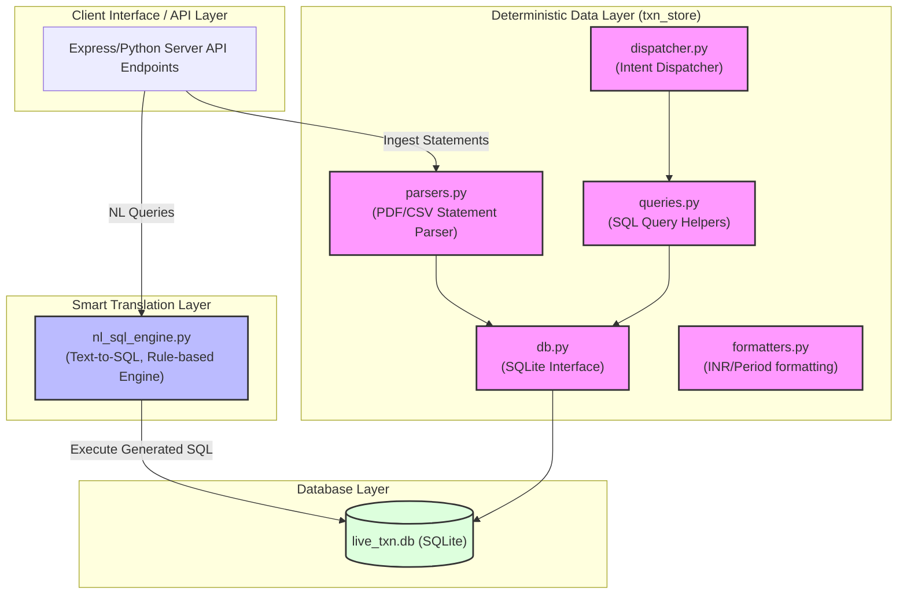
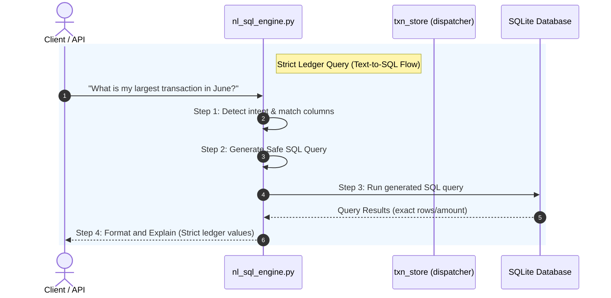

# 🏛️ Architecture Layout: FinQuery Core Services

This document maps out the architecture and design of the core financial querying modules (`txn_store` and `nl_sql_engine`) built and updated in the last 24 hours.

---

## 🗺️ Architectural Structure

The core services are split into a two-layer system: a **Deterministic Data Layer** for parsing and handling ledger interactions, and a **Smart Text-to-SQL Layer** for translating natural language queries safely.

---

## 🔄 Sequence: Flow of a Query

---

## 📦 Service Breakdown & Functionality

### 1. **Modular In-Memory Transaction Store (`txn_store/`)**
A modular subpackage managing parsing, deterministic calculations, formatting, and DB interaction.
* **[db.py](file:///c:/Users/akash/OneDrive/Desktop/thegradnew/finquery/backend/src/services/txn_store/db.py)**: SQLite database setup and transaction connection lifecycle.
* **[parsers.py](file:///c:/Users/akash/OneDrive/Desktop/thegradnew/finquery/backend/src/services/txn_store/parsers.py)**: Statement parsers for bank statements (Barclays, PNB, Wrenfield, generic PDFs) using regex and spatial text boundaries.
* **[queries.py](file:///c:/Users/akash/OneDrive/Desktop/thegradnew/finquery/backend/src/services/txn_store/queries.py)**: Standard SQL analytics queries (monthly trends, merchant aggregation, extreme debit/credit spikes, subscriptions).
* **[dispatcher.py](file:///c:/Users/akash/OneDrive/Desktop/thegradnew/finquery/backend/src/services/txn_store/dispatcher.py)**: Matches natural language queries directly to predefined analytical python functions when strict output rules are required.
* **[formatters.py](file:///c:/Users/akash/OneDrive/Desktop/thegradnew/finquery/backend/src/services/txn_store/formatters.py)**: Formatting utilities for localized currencies, tables, percentages, and normalized monthly date periods.

### 2. **Rule-Based Text-to-SQL Translator (`nl_sql_engine.py`)**
* **Strict Safety Rails**: Zero hallucination design. Avoids generative LLM math by translating statements directly into secure SQL parameters.
* **Metadata Extraction**: Automatically parses bank profiles, IFSC, Swift, account holders, and start/end dates from PDF text boundaries and upserts them to the `account_profile` table.
* **Core Loop**: Matches tokenized intents -> translates to parameterized SQL statements -> executes locally on SQLite -> constructs natural explanations based *strictly* on returned SQL values.
